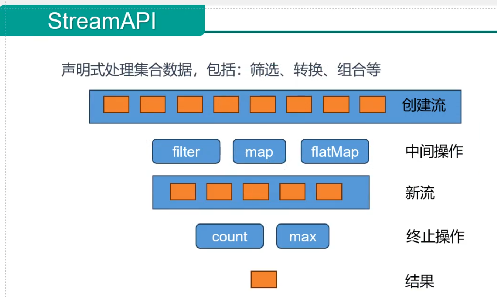

## 流式编程思想
- 首先，需要要有一个流，可以有一个数据，也可以一堆数据，甚至可以是一个空流。但是必须要有这么一个东西
- 接下来，对这个流进行中间操作，filter，map，flatMap等，可以定义一堆中间操作
- 中间操作完成后，等于会拿到一个新流
- 最终将这个流终止，如count，max统计流里面的数量，获取最大值等

## 中间操作
- filter: 过滤；挑出我们用的元素
- map: 映射；一一映射，a变成b
  - mapToInt,mapToLong,mapToDouble
- flatMap: 打散、散列；一对多映射